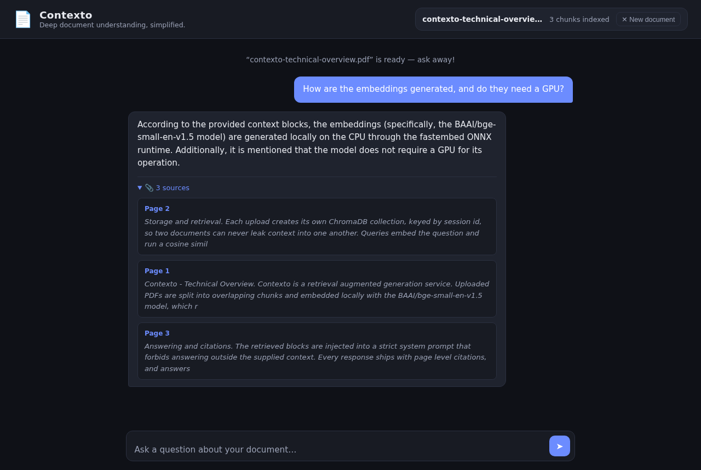
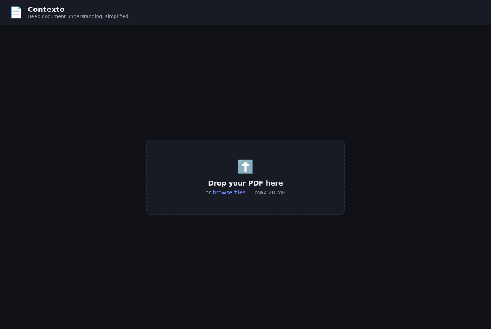
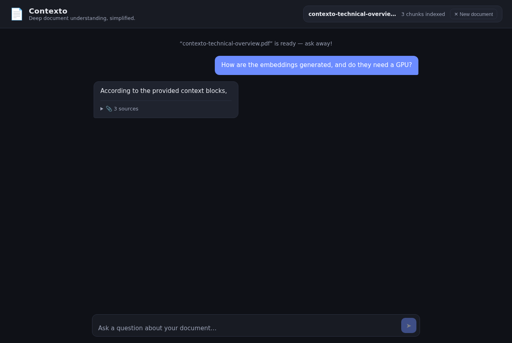

# Contexto

**Deep document understanding, simplified.**

Upload a PDF, ask questions about it, and get answers that are grounded in the
document — streamed token by token, with page-level citations attached to every
response.

Contexto is a production-shaped Retrieval-Augmented Generation (RAG) service:
FastAPI backend, local CPU embeddings, per-session vector isolation, and an LLM
layer that runs against Hugging Face, OpenAI, Gemini, or a fully local Ollama
model without a code change.



---

## Why it exists

Ask a general-purpose chatbot about a document you paste in and two things go
wrong: it invents details that were never in the document, and it gives you no
way to check. Contexto is built around the opposite contract:

- **Nothing is answered from the model's own memory.** Retrieved passages are
  injected into a system prompt that instructs the model to say "the document
  does not contain enough information" rather than guess.
- **Every answer is auditable.** Citations carry the page number and the exact
  excerpt that was retrieved, so any claim can be traced back to the source in
  one click.
- **Documents never bleed into each other.** Each upload gets its own ChromaDB
  collection keyed by session id.

---

## Features

| | |
| :--- | :--- |
| **Grounded answers** | Strict system-prompt guardrail against answering outside the retrieved context |
| **Page-level citations** | Every response ships the page number and excerpt behind it |
| **Token streaming** | Server-sent events; citations render before the first token arrives |
| **Session isolation** | One ChromaDB collection per upload — no cross-document leakage |
| **Multi-turn memory** | Follow-up questions ("elaborate on that") keep conversational context |
| **Provider-agnostic LLM** | Hugging Face, OpenAI, Gemini, Ollama, vLLM — an env var, not a rewrite |
| **No GPU, no torch** | Embeddings run on CPU via fastembed's ONNX runtime |
| **Tested** | 52 tests covering the API, RAG pipeline, provider errors, and streaming |

---

## Screenshots

| Upload | Streaming | Cited answer |
| :---: | :---: | :---: |
|  |  |  |

Citations appear as soon as retrieval finishes — before the model has written a
word — so the sources are readable while the answer is still streaming in.

---

## Architecture

```
                        ┌──────────────────────────────────────────┐
  PDF upload  ─────────▶│  POST /ingest                            │
                        │    PyPDF ─▶ RecursiveCharacterSplitter   │
                        │      ─▶ bge-small-en-v1.5 (local CPU)    │
                        │        ─▶ ChromaDB collection:session_id │
                        └──────────────────────────────────────────┘
                                            │
                                            ▼
                        ┌──────────────────────────────────────────┐
  Question  ───────────▶│  POST /query/stream                      │
                        │    embed query ─▶ cosine top-k search    │
                        │      ─▶ context + chat history + guard   │
                        │        ─▶ LLM provider (streaming)       │
                        └──────────────────────────────────────────┘
                                            │
                          SSE: sources ─▶ token ─▶ token ─▶ done
```

**Layout**

```
app/
  main.py               FastAPI app, lifespan warm-up, static hosting
  config.py             Pydantic settings + LLM provider presets
  schemas.py            Request/response models
  api/routes.py         Ingest, query, streaming query, clear
  services/
    ingestion.py        PDF load ─▶ split ─▶ embed ─▶ index
    vectorstore.py      ChromaDB client + fastembed LangChain adapter
    rag.py              Retrieval, prompt assembly, grounding guardrail
    llm.py              Provider-agnostic chat-completions client
    memory.py           Per-session multi-turn chat buffer
static/                 Dependency-free vanilla JS front end
tests/                  52 tests, fully offline
scripts/                Benchmark + screenshot automation
```

---

## Quickstart

```bash
git clone https://github.com/ArihaNoor/Contexto.git
cd Contexto

python3 -m venv venv
./venv/bin/pip install -r requirements.txt

cp .env.example .env      # then pick a provider, see below
./venv/bin/uvicorn app.main:app --reload
```

Open <http://localhost:8000>. Interactive API docs are at `/docs`.

### Choosing an LLM provider

Embeddings always run locally and never need a key. Only text generation calls
out, and you pick where:

**Fully local, zero cost** — no API key, works offline:

```bash
ollama pull llama3.2
```
```ini
LLM_PROVIDER=ollama
LLM_MODEL=llama3.2
```

**Hugging Face Inference:**
```ini
LLM_PROVIDER=huggingface
HUGGINGFACEHUB_API_TOKEN=hf_...
```

**OpenAI / Gemini:**
```ini
LLM_PROVIDER=openai          # or: gemini
LLM_API_KEY=sk-...
```

**Anything else that speaks OpenAI `/chat/completions`** (vLLM, LM Studio,
OpenRouter, Together):
```ini
LLM_BASE_URL=https://your-endpoint/v1
LLM_API_KEY=...
LLM_MODEL=...
```

### Docker

```bash
echo "HUGGINGFACEHUB_API_TOKEN=hf_..." > .env
docker compose up --build
```

The embedding model is baked into the image at build time, so the container
starts warm instead of downloading ~130 MB on the first request.

---

## API

Base path: `/api/v1/context`

| Route | Method | Body | Response |
| :--- | :--- | :--- | :--- |
| `/ingest` | `POST` | `file` (multipart PDF) | `{ session_id, total_chunks }` |
| `/query` | `POST` | `{ session_id, query }` | `{ answer, sources[] }` |
| `/query/stream` | `POST` | `{ session_id, query }` | `text/event-stream` |
| `/clear` | `DELETE` | `{ session_id }` | `{ status }` |
| `/health` | `GET` | — | `{ app, status }` |

**Streaming events** — citations arrive first, then tokens:

```
event: sources
data: {"sources": [{"page": 2, "excerpt": "Storage and retrieval..."}]}

event: token
data: {"t": "According"}

event: done
data: {}
```

Because the HTTP status line is already on the wire once streaming starts,
mid-stream failures arrive as `event: error` with a `detail` message rather than
as an HTTP error code.

**Example**

```bash
SESSION=$(curl -s -F "file=@paper.pdf" \
  localhost:8000/api/v1/context/ingest | jq -r .session_id)

curl -N -H 'Content-Type: application/json' \
  -d "{\"session_id\":\"$SESSION\",\"query\":\"What method was used?\"}" \
  localhost:8000/api/v1/context/query/stream
```

---

## Configuration

Every setting is an environment variable or `.env` entry. Defaults shown.

| Variable | Default | Purpose |
| :--- | :--- | :--- |
| `LLM_PROVIDER` | `huggingface` | `huggingface` · `ollama` · `openai` · `gemini` |
| `LLM_BASE_URL` | preset | Override for any OpenAI-compatible endpoint |
| `LLM_API_KEY` | — | Provider token (local runtimes need none) |
| `LLM_MODEL` | preset | Model id |
| `LLM_TEMPERATURE` | `0.5` | Sampling temperature |
| `LLM_MAX_TOKENS` | `512` | Answer length cap |
| `LLM_TIMEOUT_SECONDS` | `60` | Raise it for slow local CPU models |
| `EMBEDDING_MODEL` | `BAAI/bge-small-en-v1.5` | 384-dim local CPU embeddings |
| `CHUNK_SIZE` / `CHUNK_OVERLAP` | `1000` / `200` | Splitter settings |
| `TOP_K` | `4` | Chunks retrieved per query |
| `MAX_FILE_SIZE_MB` | `20` | Upload limit |
| `CHROMA_DIR` | `./chroma_db` | Vector store location |
| `LOG_LEVEL` | `INFO` | Logging verbosity |

---

## Testing

```bash
./venv/bin/pip install -r requirements-dev.txt
./venv/bin/python -m pytest
```

52 tests, no network and no API key required — the provider is stubbed with
`httpx.MockTransport`, embeddings run locally, and ChromaDB is redirected to a
temp directory. Coverage includes the ingest/query/clear lifecycle, page-number
correctness, cross-session isolation, multi-turn memory eviction, SSE event
ordering, and every provider failure mode (401 / 402 / 429 / unsupported model /
unreachable server / malformed and empty responses).

---

## Benchmarks

<!--BENCHMARKS-->

---

## Design decisions

**Local embeddings over a hosted embedding API.** `bge-small-en-v1.5` runs
through fastembed's ONNX runtime — no torch, no GPU, no per-token cost, and no
network hop on the hot path. Ingesting a 20-page PDF never leaves the machine.

**One ChromaDB collection per session.** Metadata filtering on a shared
collection would have worked, but a filter bug leaks another user's document
into an answer. Collection-level isolation makes that failure mode structurally
impossible, and `DELETE /clear` becomes a single `delete_collection` call.

**Provider-agnostic LLM client over a vendor SDK.** The original build was
pinned to `huggingface_hub`, and it broke the moment the account's free credits
ran out mid-benchmark. Since every provider worth using speaks the OpenAI
`/chat/completions` protocol, `llm.py` now talks that protocol directly over
httpx. Migrating from a dead provider to a local model is two lines of `.env`.

**Streaming with citations up front.** Retrieval finishes in milliseconds while
generation takes seconds, so the sources are known long before the answer is.
Sending them as the first SSE event means the user has something to read
immediately instead of watching a spinner.

**1-based page numbers.** pypdf indexes pages from 0; a citation that says
"page 0" is a bug report waiting to happen. Ingestion normalises at the boundary
so every layer above speaks the same language as the PDF reader.

---

## Known limitations

- **Chat memory is in-process.** Conversation history lives in a dict, so it is
  lost on restart and not shared across workers. Vector data persists; history
  does not. Redis would be the swap for multi-worker deployments.
- **Text-based PDFs only.** Scanned documents return "no extractable text" — no
  OCR pass yet.
- **No authentication.** Sessions are unguessable 128-bit ids, but anyone who
  holds one can query it. Fine for a single-user tool, not for multi-tenant use.
- **Dense retrieval only.** No hybrid BM25 or reranking, which would help on
  keyword-heavy queries such as exact identifiers.

---

## License

MIT — see [LICENSE](LICENSE).
